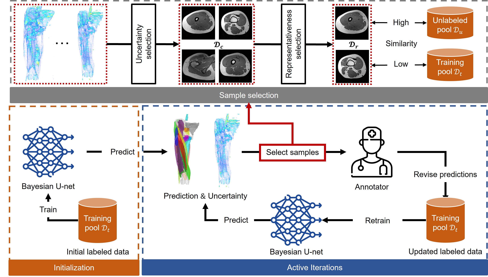
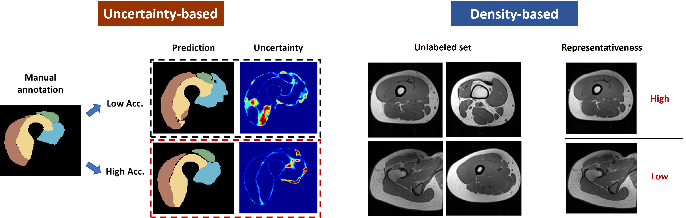
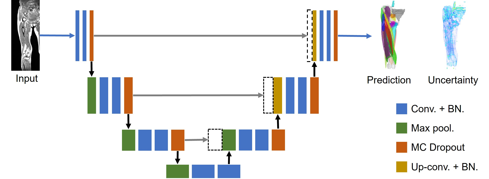
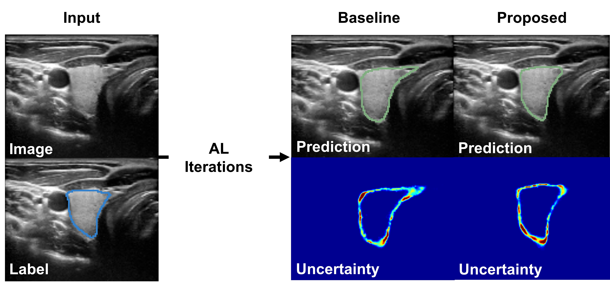
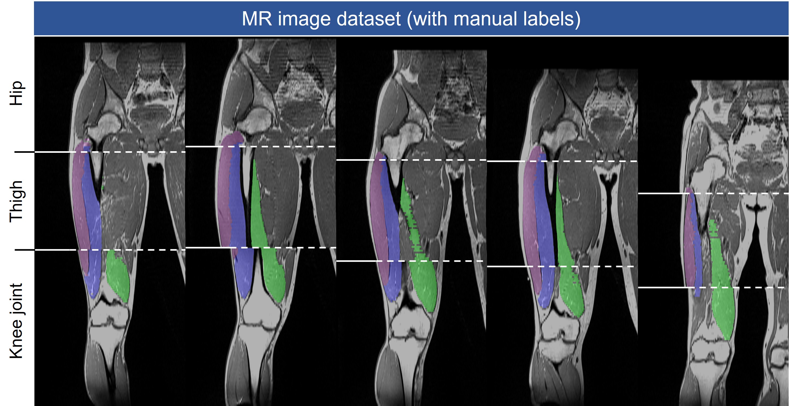
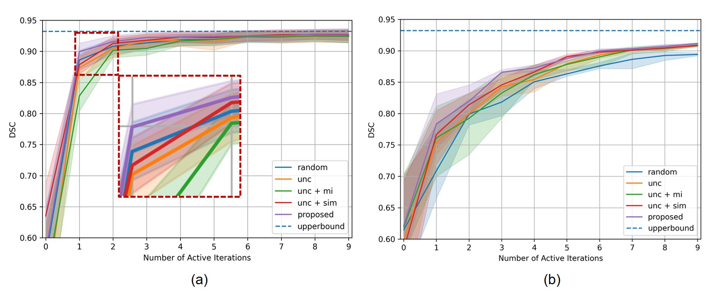
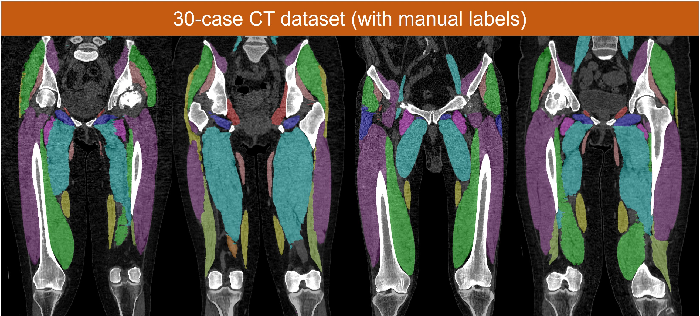
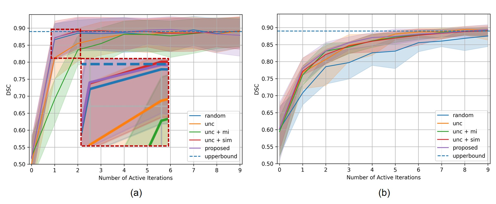
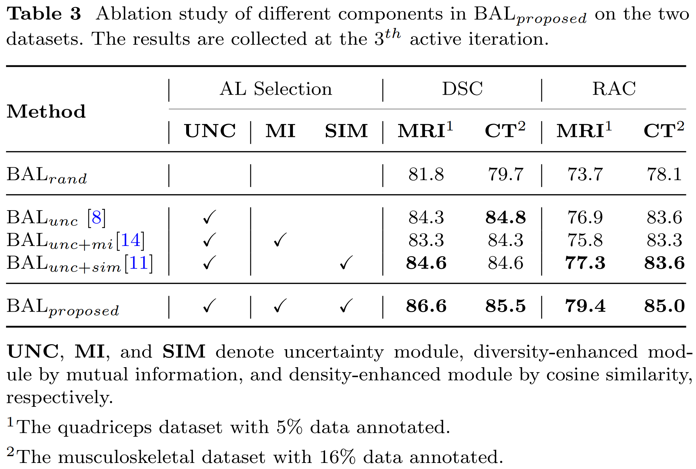

# Bayesian Active Learning in MSK Segmentation
This is a PyTorch implementation for the paper "Hybrid Representation-Enhanced Sampling 
for Bayesian Active Learning in Musculoskeletal Segmentation of Lower Extremities."
* Workflow of our BAL framework.
<p align="center">
  
</p>

* Mechanism of uncertainty-based and density-based selection strategies (previous work).
<p align="center">
  
</p>

## Updates
* [2023-04-28] Update data augmentation code for elastic distortion.
* [2023-04-23] Update multiprocessing code for acceleration.
* [2023-04-01] The codebase [Hybrid-Representation-Enhanced-Bayesian-Active-Learning](https://github.com/RIO98/Hybrid-Representation-Enhanced-Bayesian-Active-Learning) has been uploaded.

## Abstract
Purpose: Obtaining manual annotations to train deep learning (DL) models for auto-segmentation is often time-consuming.
Uncertainty-based Bayesian active learning (BAL) is a widely-adopted method to reduce annotation efforts.
Based on BAL,
this study introduces a hybrid representation-enhanced sampling strategy
that integrates density and diversity criteria
to save manual annotation costs by efficiently selecting the most informative samples.

Methods:
The experiments are performed on two lower extremity (LE)
datasets of MRI and CT images by a BAL framework based on Bayesian U-net.
Our method selects uncertain samples with high density and diversity for manual revision,
optimizing for maximal similarity to unlabeled instances and minimal similarity to existing training data.
We assess the accuracy and efficiency using Dice and a proposed metric called reduced annotation cost (RAC),
respectively.
We further evaluate the impact of various acquisition rules on BAL performance
and design an ablation study for effectiveness estimation.

Results:
The proposed method showed superiority or non-inferiority to other methods on both datasets across two acquisition rules,
and quantitative results reveal the pros and cons of the acquisition rules.
Our ablation study in volume-wise acquisition shows
that the combination of density and diversity criteria outperforms
solely using either of them in musculoskeletal segmentation.

Conclusion: Our sampling method is proven efficient in reducing annotation costs in image segmentation tasks.
The combination of the proposed method and our BAL framework provides a semi-automatic way for efficient annotation of medical image datasets.

## Segmentation model
We adopted Bayesian U-net as the segmentation model of our BAL framework.
A modified version based on [here](https://github.com/yuta-hi/pytorch_bayesian_unet/tree/master) is implemented in our work.
* Network architecture of our segmentation model, where uncertainty has been proven positively correlated with the quality of segmentation.
<p align="center">
  
</p>

```
@article{hiasa2019automated,
  title={Automated Muscle Segmentation from Clinical CT using Bayesian U-Net for Personalized Musculoskeletal Modeling},
  author={Hiasa, Yuta and Otake, Yoshito and Takao, Masaki and Ogawa, Takeshi and Sugano, Nobuhiko and Sato, Yoshinobu},
  journal={IEEE Transactions on Medical Imaging},
  year={2019},
  doi={10.1109/TMI.2019.2940555},
}
```

## Requirements
- Python 3
- CPU or NVIDIA GPU + CUDA CuDNN
- PyTorch 1.13

## Getting Started
### Installation
- Install PyTorch and dependencies from https://pytorch.org/
- For other requirements, see [requirements.txt](requirements.txt).

## Examples
### Thyroid Segmentation
Binary segmetnation of thyroid nodules on Ultrasonography. This example's dataset contributed by T. Wunderling and can be downloaded from [here](https://opencas.webarchiv.kit.edu/?q=node/29).
```
@inproceedings{wunderling2017comparison,
  title={Comparison of thyroid segmentation techniques for 3D ultrasound},
  author={Wunderling, Tom and Golla, B and Poudel, Prabal and Arens, Christoph and Friebe, Michael and Hansen, Christian},
  booktitle={Medical Imaging 2017: Image Processing},
  volume={10133},
  pages={346--352},
  year={2017},
  organization={SPIE}
}
```
The dataset consists of 15186 ultrasound images from 16 patients,
split into 1:10:2:3 for the training set, unlabeled pool, validation set, and testing set, respectively.
```
python examples/us_thyroid_segmentation/preprocess.py # download the dataset and convert label format
run run_BayesianAL_atuo_US.sh # run the BAL framework with specified acquisition strategies.
```
<p align="center">
  
</p>

## Performance
### T-1 weighted MRI dataset (5-class)
* Coronal views
<p align="center">
  
</p>
* DSC results of different acquisition rules on the MRI dataset.
<p align="center">
  
</p>

### CT dataset ((23-class))
* Coronal views
<p align="center">
  
</p>
* DSC results of different acquisition rules on the CT dataset.
<p align="center">
  
</p>

### Ablation study
<p align="center">
  
</p>

